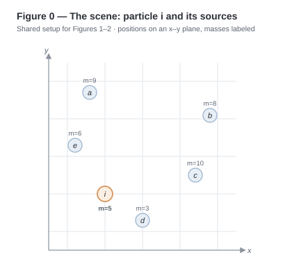
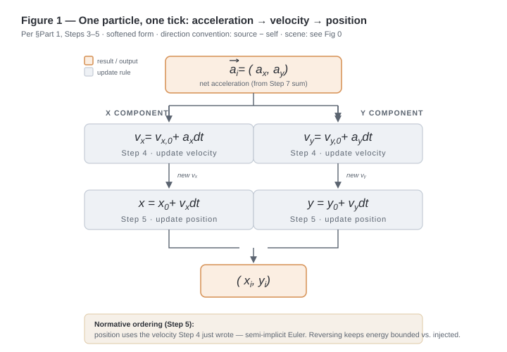
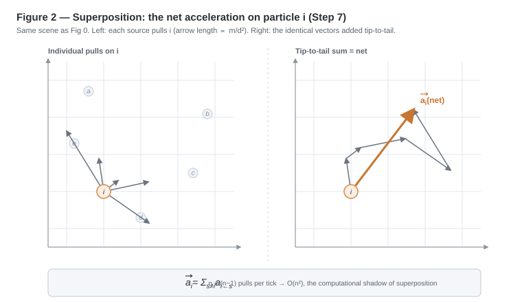
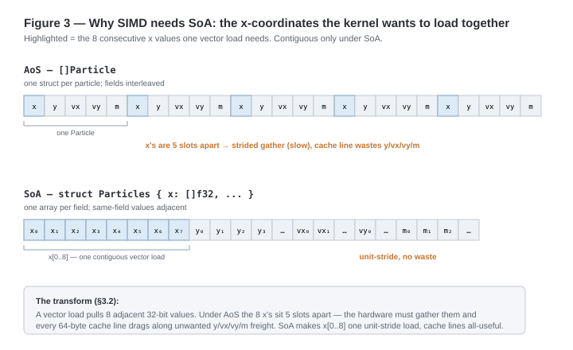
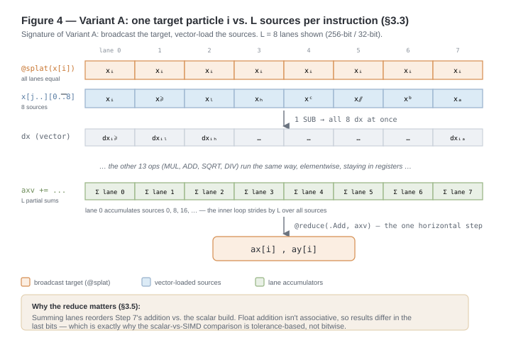

# RFC: Gravity / N-Body Particle Simulation

**Status:** Parts 1–3 complete · Part 4 parked · figures embedded
**Language:** Zig · **Renderer:** raylib (via raylib-zig)
**Reference:** Core Dumped, *"Why compilers can't optimize this"* (SIMD gravity simulation) — used for notation and motivation only; all results derived from first principles below.

---

## 0. Scope and goals

This document specifies a 2D gravitational N-body simulation, to be implemented twice over the **same algorithm**:

1. A **scalar baseline** (Part 2) — the natural implementation a reasonable engineer writes first.
2. A **SIMD implementation** (Part 3) — identical algorithm, transformed memory layout, vector instructions.

The purpose of the project is (a) to learn SIMD programming against an honest baseline, and (b) to produce a visually compelling demo (orbiting, accreting particle disk). Correctness is defined by the physics in Part 1; performance claims are defined by the measurement rules in §2.5.

**Goals:** deterministic, reproducible physics; a fair scalar-vs-SIMD comparison; merging/accretion in the baseline; a demo worth watching.
**Non-goals (for now):** 3D, Barnes–Hut, elastic collisions, multithreading — parked in Part 4 with their physics pre-specified where known.

The implementor is **not** assumed to be a physicist or to know SIMD. Part 1 derives everything used later; Appendix A defines hardware and math vocabulary.

**Requirement words.** *Normative* sections and the words **must / must not** are requirements; violating them produces a simulation that is wrong, non-deterministic, or unbenchmarkable. **Should** marks strong defaults; **may** marks options.

---

## Part 1 — Physics and algorithm

Notation used throughout: particle $i$ has mass $m_i$, position $(x_i, y_i)$, velocity $(v_{x,i}, v_{y,i})$. For an accelerated particle $i$ and a source particle $s$:

$$dx_{is} = x_s - x_i, \qquad dy_{is} = y_s - y_i, \qquad d_{is} = \sqrt{dx_{is}^2 + dy_{is}^2}$$

**Direction convention (normative):** $dx, dy$ always point **from the accelerated particle toward the source**. This makes gravity attractive with no sign correction. Reusing one particle's $dx, dy$ for the reverse pair without flipping signs is a classic bug: both particles accelerate the same way and the pair flies off together.

### Step 1 — The two laws

**Universal gravitation** (force magnitude between two point masses at distance $d$):

$$F = G \frac{m_i\, m_j}{d^2}$$

$G$ is the gravitational constant. In this simulator it is a **configuration parameter**, not the SI value $6.674\times10^{-11}$ — and this is not a fudge factor. A cloud of particles on screen has no privileged units: the moment a mass is stored as `1.0` and a position as a pixel coordinate, we have left the SI universe and are working in **simulation units**. There, $G$ is the one free coupling constant that sets how strong gravity is relative to the chosen mass, length, and time scales; it is tuned so accelerations stay O(1) (keeping `f32` precision) and the demo evolves at a watchable pace. A common instinct is to instead keep $G$ at its SI value and multiply all accelerations by a separate visual-scale constant $k$ — but $G$ and $k$ only ever appear as the product $kG$ in Step 7, so no measurement in the program could tell them apart. One knob suffices; a second would be mathematically redundant.

**Newton's second law:** $F = m a$, hence $a = F/m$.

### Step 2 — Acceleration magnitude of particle $i$

Divide the gravitational force by the accelerated particle's own mass:

$$a_i = \frac{F}{m_i} = \frac{G\, m_i\, m_j}{d^2\, m_i} = G\frac{m_j}{d^2}$$

$m_i$ cancels: **a particle's acceleration depends only on the *other* particle's mass and the distance.** Implementation consequence: the inner loop never reads the mass of the particle being accelerated. Heavy and light particles at the same place accelerate identically (equivalence principle).

### Step 3 — Direction: the unit vector, and where $d^3$ comes from

Acceleration in 2D is a vector $(a_x, a_y)$: Step 2's magnitude times a direction. The direction is the **unit vector** from $i$ toward $j$ — the separation scaled down by its own length:

$$\hat{u} = \left(\frac{dx}{d},\; \frac{dy}{d}\right), \qquad |\hat{u}| = \frac{\sqrt{dx^2+dy^2}}{d} = 1$$

Magnitude × direction:

$$\vec{a}_i = G\frac{m_j}{d^2}\left(\frac{dx}{d}, \frac{dy}{d}\right)$$

Distribute into components; the denominators merge, $\tfrac{1}{d^2}\cdot\tfrac{1}{d} = \tfrac{1}{d^3}$:

$$\vec{a}_i = \left(G\frac{m_j\, dx}{d^3},\; G\frac{m_j\, dy}{d^3}\right)$$

**One factor of d² is physics (inverse-square law); one factor of d is geometry (normalizing the direction arrow). d³ is bookkeeping, not new physics** — the magnitude of this vector is still $G m_j / d^2$. This fused form is the one to implement: with $d^2 = dx^2 + dy^2$ in hand, $d^3 = d^2\sqrt{d^2}$, so the whole per-pair computation costs one square root and no separate normalization.

### Step 4 — Acceleration → velocity

Acceleration is the rate of change of velocity. Over a small time interval $dt$, with $v_{x_0}, v_{y_0}$ the velocity before the interval:

$$v_x = v_{x_0} + a_x\, dt \qquad\qquad v_y = v_{y_0} + a_y\, dt$$

Components update independently — $x$ math never touches $y$ math (this independence is what makes the SIMD version natural later).

There is no special case for a stationary particle: $v_{x_0} = 0$ is just a value. Acceleration never acts on position directly; it acts on velocity, and velocity acts on position — which is why particles curve toward masses rather than beelining.

### Step 5 — Velocity → position

The identical argument one level down, with $x_0, y_0$ the position before the interval:

$$x = x_0 + v_x\, dt \qquad\qquad y = y_0 + v_y\, dt$$

**Normative ordering (semi-implicit / symplectic Euler):** Step 5 **must** use the velocity *already updated* by Step 4 (the new $v_x$, not $v_{x_0}$). Both orderings look valid; the reversed order (explicit Euler) systematically injects energy — orbits spiral outward, clusters unbind. Same instruction count, materially different long-run behavior.




**Figure 0.** The shared setup for Figures 1–2: particle $i$ (accent) and its sources $a$ through $e$ placed on the plane with their masses. Everything downstream reads positions and masses from this scene.



**Figure 1.** One particle, one tick (Steps 3–5). The net acceleration splits into $x$ and $y$ components; each drives a velocity update (Step 4), then a position update (Step 5) using the just-updated velocity; the two recombine into the new coordinates $(x_i, y_i)$.

### Step 6 — The interaction is mutual (Newton's third law)

The gravitational force is symmetric in $i$ and $j$, so the same-magnitude force acts on both, in opposite directions. Repeating Steps 2–3 with roles swapped (and the direction convention applied from $j$'s perspective):

$$\vec{a}_j = \left(G\frac{m_i\, dx_{ji}}{d^3},\; G\frac{m_i\, dy_{ji}}{d^3}\right), \qquad dx_{ji} = x_i - x_j = -\,dx_{ij}$$

General rule, for any accelerated particle $p$ and source $s$:

$$\vec{a}_{p \leftarrow s} = \left(G\frac{m_s\,(x_s - x_p)}{d^3},\; G\frac{m_s\,(y_s - y_p)}{d^3}\right)$$

Consequences:

- **Opposite but not equal:** each particle's acceleration carries the *other's* mass. A light particle accelerates harder than the heavy one pulling it (a swarm of light particles swirls around a heavy center that barely budges). This is test (a) in §2.5.
- **Shared work (informative):** both directions of a pair share $dx, dy, d^3$ (up to sign). A scalar implementation *may* iterate unordered pairs and apply the geometry twice, halving Phase-A work. This RFC does **not** adopt that optimization as normative: it creates scattered writes that fight the SIMD formulation, and the scalar and SIMD builds must implement the same specified algorithm for the comparison to be fair. (Recorded again in Part 4.)

### Step 7 — Superposition: many sources

Gravity superposes: sources neither shield nor amplify one another. The net acceleration on $i$ is the plain vector sum of per-source contributions:

$$\vec{a}_i = \sum_{s \neq i} \vec{a}_{is} \qquad\Longleftrightarrow\qquad a_x = \sum_{s \neq i} G\frac{m_s\, dx_{is}}{d_{is}^3}, \quad a_y = \sum_{s \neq i} G\frac{m_s\, dy_{is}}{d_{is}^3}$$

Geometrically this is tip-to-tail vector addition; computationally it is two accumulators zeroed and added into across all sources. Contributions can partially cancel — a particle at the center of a symmetric cloud feels almost nothing.

**Cost:** each of $n$ particles sums over $n-1$ sources → $n(n-1) \approx n^2$ pair evaluations per tick. **O(n²) is the computational shadow of the superposition principle**, not an implementation detail. Micro-optimization (including SIMD) shrinks the constant; only a different physics *approximation* (e.g. Barnes–Hut, Part 4) changes the exponent.




**Figure 2.** Superposition (Step 7) on the Fig 0 scene. Left: each source pulls $i$ with an arrow whose length tracks $m/d^2$ (near/heavy $e$ and $c$ dominate; far/light $d$ is faint). Right: the identical vectors walked tip-to-tail; the accent arrow from $i$ to the final tip is the net acceleration $\vec{a}_i$.

### Step 8 — The tick

One tick advances simulated time by $dt$ in two phases, in this order:

- **Phase A (accelerate):** for every particle $i$, compute $\vec{a}_i$ by Step 7, reading positions and masses only. **No particle state is modified.**
- **Phase B (integrate):** for every particle, apply Step 4 then Step 5 (velocity first, then position with the new velocity).

Then the process repeats: the next tick's Phase A reads the positions Phase B just wrote.

**Normative — frozen snapshot:** every acceleration in a tick **must** be computed from the same snapshot of positions. Fusing the phases (compute $\vec{a}_i$, immediately move $i$, proceed to $i{+}1$) makes results depend on iteration order, silently breaks the pairwise symmetry of Step 6, destroys the exactness of momentum conservation (Step 9), and makes runs irreproducible under any reordering — including the lane reordering SIMD introduces, which would make scalar-vs-SIMD output comparison impossible. Concretely: accelerations get their own scratch arrays (`ax[]`, `ay[]`), filled in Phase A, consumed in Phase B.

### Softening — bounding the force law (normative)

Step 7 divides by $d_{is}^3$, and nothing prevents $d \to 0$: particles move in straight jumps of $v \cdot dt$, so one can land essentially on top of another between ticks. The acceleration then diverges ($d$ ten times smaller → acceleration a hundred times larger, without bound — a **singularity**). One such tick produces a colossal velocity; the particle teleports across the screen, or the velocity overflows to `inf`, breeds `NaN`, and poisons every subsequent sum.

**Fix:** add a small positive constant $\varepsilon^2$ to $d^2$ before it enters the denominator. Everywhere the law had $d^3 = (d^2)^{3/2}$:

$$(d^2)^{3/2} \;\longrightarrow\; (d^2 + \varepsilon^2)^{3/2}$$

giving the normative force law actually implemented:

$$\vec{a}_{is} = \left(G\frac{m_s\, dx_{is}}{(d_{is}^2 + \varepsilon^2)^{3/2}},\; G\frac{m_s\, dy_{is}}{(d_{is}^2 + \varepsilon^2)^{3/2}}\right)$$

Behavior in the two limits:

- **Far apart** ($d \gg \varepsilon$): $d^2 + \varepsilon^2 \approx d^2$ — the true Newtonian law, unchanged where particles spend their time. (E.g. $\varepsilon = 0.05$, $d = 1$: a 0.25 % perturbation on $d^2$.)
- **Very close** ($d \ll \varepsilon$): denominator $\approx \varepsilon^3$, so $a \approx G m_s d / \varepsilon^3 \to 0$ as $d \to 0$. The force rises, peaks near $d \sim \varepsilon$, and falls to zero — **bounded everywhere**.

$\varepsilon$ is called the **softening length**: it has units of distance, and it reinterprets each point mass as a fuzzy ball roughly $\varepsilon$ across. Real gravity already behaves this way for extended bodies (inside a planet, the shells above you cancel; gravity falls to zero at the center), so this is a model swap — points → tiny planets — not a hack.

Side benefits, both load-bearing:

1. **No self-interaction branch.** At $s = i$: numerator $= 0$, denominator $= \varepsilon^3 > 0$, so the self-term is exactly $0$. The inner loop legally omits `if (i != j)` — its absence is **intentional**; do not "fix" it back in. (SIMD lanes are very glad not to have it.)
2. **No NaN can be born in Phase A.** $d^2 + \varepsilon^2 \geq \varepsilon^2 > 0$ always, so the division and square root never see zero or a negative.

**Tuning trade-off:** $\varepsilon$ too small → close encounters still deliver huge finite kicks, demanding tiny $dt$; too large → nearby particles barely attract, washing out clustering. Heuristic default: the typical near-neighbor spacing, on the order of $L/\sqrt{n}$ for $n$ particles in a region of size $L$; then tune by eye.

### Step 9 — Momentum conservation

**Momentum** of a particle: $\vec{p}_i = m_i \vec{v}_i$ (a vector). Total: $\vec{P} = \sum_i \vec{p}_i$.

**Claim:** the algorithm conserves $\vec{P}$ exactly (to floating-point rounding). One tick changes $\vec{p}_i$ by $m_i \vec{a}_i\, dt$ (Step 4). By Step 7 the total change decomposes into pairwise contributions, and by Step 6 each unordered pair contributes twice with equal magnitude and opposite sign:

$$\Delta\vec{P} = \sum_i m_i \vec{a}_i\, dt = \sum_{\text{pairs } \{i,s\}} \big(m_i \vec{a}_{is} + m_s \vec{a}_{si}\big)\, dt = \vec{0}$$

Every push is refunded, component for component. Notes:

- The cancellation holds **in the discrete algorithm**, not just the continuous physics — *provided* Phase A used one frozen snapshot (Step 8). That is what makes momentum a usable acceptance test (§2.5) rather than a loose ideal.
- The argument uses only the pairwise equal-and-opposite structure, never the form of the force — so it survives softening untouched, and it must survive any collision rule (Step 10), which is just a very strong internal interaction.
- Corollary: the **center of mass** $\vec{X} = \frac{1}{M}\sum_i m_i \vec{x}_i$ (with $M = \sum_i m_i$) has velocity $\vec{P}/M$ and therefore drifts in a straight line at constant speed forever, whatever the particles do individually.

### Step 10 — Merging: the perfectly inelastic collision

**Rule to specify:** when two particles come closer than a threshold, replace them with one. Every field of the merged particle is **forced** by conservation laws, not chosen:

- **Mass** (additive): $m_{new} = m_i + m_j$
- **Velocity** (forced by Step 9 — momentum before = momentum after):

$$\vec{v}_{new} = \frac{m_i\vec{v}_i + m_j\vec{v}_j}{m_i + m_j}$$

- **Position** (center of mass of the pair):

$$x_{new} = \frac{m_i x_i + m_j x_j}{m_i + m_j}, \qquad y_{new} = \frac{m_i y_i + m_j y_j}{m_i + m_j}$$

  Any other placement makes the system's center of mass jump, breaking Step 9's straight-line-drift corollary.

All three are the same mass-weighted-average shape. Un-weighted averages fail the momentum test on the first merge — which is precisely why that test exists.

**Kinetic energy is destroyed, as a theorem.** Kinetic energy $KE = \tfrac{1}{2}mv^2$ is a scalar and, unlike momentum, is *not* conserved by sticking collisions. With $\vec{v}_{new}$ forced as above, algebra gives the exact loss:

$$\Delta KE = \tfrac{1}{2}\,\mu\, v_{rel}^2 \;\geq\; 0, \qquad \mu = \frac{m_i m_j}{m_i + m_j}, \qquad v_{rel} = |\vec{v}_i - \vec{v}_j|$$

where $\mu$ is the **reduced mass** (Appendix A) and $v_{rel}$ the relative approach speed. Readings: the loss depends only on **relative** motion (lockstep particles merge for free); it grows with the *square* of the closing speed (head-on crashes are maximally lossy); it is never negative (sticking never creates motion). Worked check — equal masses $m$, head-on at $\pm v$: momentum forces $\vec{v}_{new} = 0$; $\Delta KE = \tfrac12 \cdot \tfrac{m}{2} \cdot (2v)^2 = mv^2$, the entire kinetic budget.

Physically the lost energy becomes internal heat ("the splat"). The simulation restores exact bookkeeping with one optional per-particle scalar `heat`, incremented by $\Delta KE$ at each merge: **kinetic + gravitational potential + total heat ≈ constant** (up to integration error), giving the strengthened energy test in §2.5 and a free visual channel (heat → brightness, with slow decay = radiative cooling; violent mergers flare, gentle ones barely glow).

**Rejected alternative — "keep it all kinetic":** boosting $\vec{v}_{new}$ to preserve $KE$ (i) has no defined direction ($KE$ is a scalar) and (ii) violates momentum conservation, which is visually catastrophic: the center of mass wanders, merged blobs kick off like rockets, dense regions self-heat and explode instead of accreting. Momentum — the law with no exceptions — wins. (The physical way to conserve $KE$ is an elastic *bounce*, i.e. no merging; rejected in Part 4.)

---

## Part 2 — Reference (scalar) implementation

This part specifies the **naive implementation on purpose**: natural array-of-structures layout, straightforward loops. It is the experimental control — Part 3's claim ("same algorithm, different memory layout and instruction width, ~8× faster") is only measurable against the honest baseline a reasonable engineer would write first.

### 2.1 Data layout

```zig
pub const Particle = struct {
    x: f32,
    y: f32,
    vx: f32,
    vy: f32,
    mass: f32,
    heat: f32,          // Step 10: accumulated ΔKE from merges (visual/diagnostic)
};

pub const Sim = struct {
    particles: []Particle,  // capacity = initial n; live prefix is particles[0..n]
    n: usize,               // live count — shrinks when merging is enabled
    ax: []f32,              // Phase A output, Phase B input (sized to capacity)
    ay: []f32,
};
```

Particles are stored contiguously (array of structures, matching the video's scalar `Particle`). Accelerations live in separate scratch arrays from day one: they are **derived per-tick state**, not particle identity (Step 8's frozen-snapshot rule), and the split survives unchanged into Part 3's SoA layout. All buffers are allocated once at startup to initial capacity; merging only ever shrinks `n` — no reallocation mid-run.

### 2.2 Configuration

All constants are explicit config, none hard-coded. Every recorded measurement or run includes the full config and seed.

| Name | Type | Meaning | Default / guidance |
|---|---|---|---|
| `g` | f32 | Gravitational coupling constant, simulation units (Step 1) | tune for O(1) accelerations & watchable pace |
| `dt` | f32 | Simulated seconds per tick — **fixed**, frame-independent (§2.4) | small; tune with `g` |
| `n` | usize | Initial particle count | benchmark variable |
| `eps2` | f32 | Softening length squared, $\varepsilon^2$ | $\varepsilon \sim L/\sqrt{n}$, then by eye |
| `d_merge2` | f32 | Merge threshold squared, $d_{merge}^2$ | $\approx$ `eps2` (§2.6 synergy) |
| `merging` | bool | Enable Phase C | **off for benchmarks**, on for demo |
| `heat_decay` | f32 | Per-tick heat multiplier (visual cooling) | e.g. 0.999; **1.0 for energy tests** |
| `jitter` | f32 | Velocity noise as a fraction of $v_{circ}$ (§2.7) | a few percent |
| `preset` | enum | Initial conditions: `disk` \| `keplerian` (§2.7) | `disk` |
| `seed` | u64 | PRNG seed — sole source of randomness | recorded always |

### 2.3 The tick (normative kernel)

```zig
pub fn tick(sim: *Sim, cfg: Config) void {
    const ps = sim.particles[0..sim.n];

    // ---- Phase A: accelerations from a frozen snapshot (Steps 7–8) ----
    for (ps, 0..) |pi, i| {
        var ax: f32 = 0.0;
        var ay: f32 = 0.0;
        for (ps) |pj| {                              // j == i term is zero via softening
            const dx = pj.x - pi.x;                  // SUB
            const dy = pj.y - pi.y;                  // SUB
            const d2 = dx * dx + dy * dy + cfg.eps2; // MUL MUL ADD ADD
            const inv_d3 = 1.0 / (d2 * @sqrt(d2));   // SQRT MUL DIV
            const s = cfg.g * pj.mass * inv_d3;      // MUL MUL
            ax += s * dx;                            // MUL ADD
            ay += s * dy;                            // MUL ADD
        }
        sim.ax[i] = ax;
        sim.ay[i] = ay;
    }

    // ---- Phase B: integrate — velocity first, then position (Steps 4–5) ----
    for (ps, 0..) |*p, i| {
        p.vx += sim.ax[i] * cfg.dt;
        p.vy += sim.ay[i] * cfg.dt;
        p.x += p.vx * cfg.dt;
        p.y += p.vy * cfg.dt;
        p.heat *= cfg.heat_decay;                    // presentation, not physics
    }

    // ---- Phase C: merging (Step 10), greedy with restart (§2.6) ----
    if (!cfg.merging) return;                        // off for benchmarks (fixed n)
    var restart = true;
    while (restart) {
        restart = false;
        scan: for (0..sim.n) |i| {
            for (i + 1..sim.n) |j| {
                const dx = sim.particles[j].x - sim.particles[i].x;
                const dy = sim.particles[j].y - sim.particles[i].y;
                const d2 = dx * dx + dy * dy;
                if (d2 < cfg.d_merge2) {             // squared compare: no sqrt
                    merge(sim, i, j);
                    restart = true;                  // indices stale after merge
                    break :scan;
                }
            }
        }
    }
}

fn merge(sim: *Sim, i: usize, j: usize) void {
    const a = sim.particles[i];
    const b = sim.particles[j];
    const m = a.mass + b.mass;

    // ΔKE = ½ μ v_rel² — compute BEFORE overwriting velocities (Step 10)
    const rvx = a.vx - b.vx;
    const rvy = a.vy - b.vy;
    const mu = (a.mass * b.mass) / m;
    const dke = 0.5 * mu * (rvx * rvx + rvy * rvy);

    sim.particles[i] = .{
        .x  = (a.mass * a.x  + b.mass * b.x)  / m,   // center of mass  (Step 10)
        .y  = (a.mass * a.y  + b.mass * b.y)  / m,
        .vx = (a.mass * a.vx + b.mass * b.vx) / m,   // momentum        (Step 9)
        .vy = (a.mass * a.vy + b.mass * b.vy) / m,
        .mass = m,
        .heat = a.heat + b.heat + dke,               // energy bookkeeping (Step 10)
    };

    // swap-remove j: O(1); legal because nothing depends on particle order (§2.6)
    sim.n -= 1;
    sim.particles[j] = sim.particles[sim.n];
}
```

Kernel notes:

- The Phase-A inner loop body is ~14 arithmetic operations including one `sqrt` and one `div` (the two expensive ones), executed $n^2$ times per tick. This sentence is Part 2's closing line and Part 3's opening line: SIMD's offer is the same fourteen operations processing eight pairs each.
- Direction convention checked: `dx = pj.x - pi.x` points from accelerated particle toward source (Part 1 convention), so attraction needs no sign fiddling and the Step 6 symmetry bug cannot occur.
- `@sqrt` (the hardware instruction) is **required**; not a library `pow(d2, 1.5)` — for speed and so scalar and SIMD builds compute comparably.
- Phase A visits all **ordered** pairs; Phase C visits each **unordered** pair once (`j` from `i+1`). The asymmetry is deliberate — the phases answer different questions, and Phase A's regular full loop is the shape Part 3 vectorizes (Step 6's pairwise-sharing trick is recorded as rejected for the baseline).
- In `merge()`, `dke` is computed **above** the overwrite because it needs both original velocities; moving it below silently reads a merged velocity. Merged heat pools both bodies' budgets plus the splat, keeping the global energy invariant exact across merges.
- The `restart` loop implements §2.6's chain rule: each merge strictly decreases `n`, so it terminates; fixed scan order makes it deterministic (same seed → same merges → same trajectory).

### 2.4 Outer loop (fixed timestep)

Physics and rendering run on different clocks. `dt` is simulated time per tick (fixed config); the renderer redraws at whatever rate the display runs. Coupling them ("dt = one frame") makes simulation speed machine-dependent and destroys the scalar-vs-SIMD comparison (the faster build would simulate different physics per second).

```zig
var accumulator: f32 = 0.0;
while (rendering) {
    accumulator += frame_time_seconds;       // measured wall-clock since last frame
    if (accumulator > 10 * cfg.dt)           // clamp: spiral-of-death guard
        accumulator = 10 * cfg.dt;
    while (accumulator >= cfg.dt) {
        tick(&sim, cfg);
        accumulator -= cfg.dt;
    }
    draw(sim.particles[0..sim.n]);
}
```

**Clamp is normative.** Without it, a slow frame (exactly what happens at large $n$) demands more ticks, making the next frame slower, demanding more ticks — the spiral of death. Under clamp, an overloaded simulation slows down gracefully instead of locking up.

Properties bought: identical physics on every machine; determinism (same seed + config → same trajectory), which makes scalar and SIMD builds *testable against each other*, not just benchmarkable; and clean instrumentation, since ns-per-tick is well-defined regardless of rendering load.

### 2.5 Instrumentation and acceptance tests

**Measurement rules (normative):**

1. Builds are compared only under `-Doptimize=ReleaseFast`.
2. The reported metric is **Phase A wall time per tick, in nanoseconds** (`std.time.Timer` around Phase A) — never FPS; rendering must not contaminate the physics number.
3. Performance measurements are meaningful only at fixed $n$: benchmark with `merging = false`.
4. All randomness flows from the single config `seed`, recorded with every measurement.

**Correctness tests** (all cheap; each verifies a named Part 1 result):

| Test | Setup | Pass condition | Verifies |
|---|---|---|---|
| (a) Two-body | $m=1000$ + $m=1$, offset, small tangential velocity on the light one | light particle orbits; heavy one barely wobbles | Step 6 asymmetry |
| (b) Momentum | any seed; thousands of ticks; **merging on** | $\sum m_i \vec{v}_i$ constant to rounding, **across merge events** | Steps 9–10 |
| (c) CoM drift | as (b) | center of mass moves in a straight line at constant speed | Step 9 corollary, Step 10 position rule |
| (d) Energy | two-body orbit, ~10⁴ ticks, `heat_decay = 1.0` | orbit radius does not systematically grow; with merging: $KE + PE + \sum heat$ constant up to integration error, each merge's $KE$ step $=$ its recorded $\Delta KE$ | Step 5 ordering; Step 10 |
| (e) Determinism | same seed + config, same tick count | bitwise-identical state (scalar build) | Step 8, §2.6 ordering |

**Forward-looking clause:** the eventual scalar-vs-SIMD comparison is **tolerance-based, not bitwise** — SIMD reorders the Step 7 summation and float addition is not associative. Outputs agreeing to within a small relative tolerance is the expected, correct result; differences in the 7th decimal are not a bug.

### 2.6 Merging (normative)

**Rule.** After Phase B, any pair with $d^2 < d_{merge}^2$ merges per Step 10's formulas (embodied in `merge()` above). Default $d_{merge} \approx \varepsilon$: the simulation then never lingers in the regime where softening distorts the force law — the two mechanisms cover for each other.

Three forks, pinned so the implementor doesn't take them silently:

- **Placement:** the merge pass is a distinct **Phase C, after integration**, never inside Phase A — accelerations are computed over a stable particle set.
- **Chains:** if the *a*–*b* and *b*–*c* pairs both cross the threshold in one tick, process **greedily**: merge the first pair found in fixed scan order, rescan. The merged product may merge again next tick. At sane `dt` chains are rare; correctness beats cleverness, and greedy with fixed order is deterministic.
- **Removal:** **swap-remove** (move last live particle into the vacated slot, decrement `n`) — $O(1)$, legal because nothing in the algorithm depends on particle order.

Cost note: the naive scan is $O(n^2)$ distance checks but cheap per pair (squared compare, no sqrt) and reuses Phase A's pair-geometry shape — it vectorizes by the same recipe in Part 3.

### 2.7 Initial conditions: the spinning disk

Seeding answers three per-particle questions — where, how heavy, how fast — and one global one: **why doesn't the cloud fall into its own center?**

**Why tangential velocity.** Seeded at rest, every particle accelerates toward the mass concentration (Step 7); everything meets at the middle within a few dynamical times and — with merging on — splats into one fat particle in the opening seconds. The fix is the Moon's trick: sideways motion. A circular orbit of radius $r$ at speed $v$ requires inward (**centripetal**, "center-seeking") acceleration $v^2/r$; gravity supplies $G M_{enc}(r)/r^2$, where $M_{enc}(r)$ is the **enclosed mass** — the mass inside radius $r$, which is what effectively pulls inward (outer shells largely cancel). Balancing supply and demand:

$$\frac{v_{circ}^2}{r} = \frac{G\,M_{enc}(r)}{r^2} \qquad\Longrightarrow\qquad v_{circ}(r) = \sqrt{\frac{G\,M_{enc}(r)}{r}}$$

Seeded at $v_{circ}$ tangentially, the disk rotates instead of collapsing; because the disk is lumpy rather than analytic, individual orbits drift, particles encounter each other, and accretion proceeds slowly and watchably.

**Positions** — uniform disk of radius $R$ at the origin. Angle $\theta \sim \text{Uniform}[0, 2\pi)$. Radius **must not** be drawn uniformly in $[0,R]$ (over-crowds the center: a ring at radius $r$ has area $\propto r$). Uniform *area* density requires:

$$r = R\sqrt{u}, \qquad u \sim \text{Uniform}[0,1)$$

then $x = r\cos\theta$, $y = r\sin\theta$. For the uniform disk, enclosed mass is closed-form: $M_{enc}(r) = M_{total}\,(r/R)^2$, so $v_{circ}(r) \propto \sqrt{r}$ (rising with radius).

**Presets.** `disk`: as above. `keplerian`: additionally one heavy central particle (mass 10–100× the others, at the origin, zero velocity); then $M_{enc} \approx M_{central}$ dominates and $v_{circ} \propto 1/\sqrt{r}$ — fast inside, slow outside, the solar-system look.

**Velocities** — tangential direction by quarter-turn rotation. The outward unit vector is $(x/r, y/r)$; rotating any 2D vector 90° counterclockwise maps $(a,b) \mapsto (-b,a)$ (dot product $a(-b) + ba = 0$: perpendicular, i.e. tangent). So:

$$v_x = -\,v_{circ}\,\frac{y}{r}, \qquad v_y = +\,v_{circ}\,\frac{x}{r} \qquad \text{(counterclockwise; negate both for CW)}$$

Add per-component jitter of `jitter` $\times\, v_{circ}$: a perfectly cold disk is glassy; jitter seeds the encounters that drive merging.

**Masses** — Uniform in a modest band (default $[0.5, 1.5]$): enough variety that merges produce visibly heavier, hotter particles; not so much that one particle dominates from birth.

**Determinism & momentum zeroing** — all draws flow from the seeded PRNG (`std.Random.DefaultPrng`). After seeding, **subtract the mass-weighted mean velocity from every particle** so total momentum starts at exactly $\vec{0}$: jitter otherwise leaves a small net drift (the disk slides offscreen over long runs), and zeroing makes test (b)'s target a clean zero.

---

## Part 3 — SIMD implementation (normative)

The transformation from Part 2 has exactly three genuinely new ideas — lane orientation (§3.3), padding-as-physics (§3.2), and chaos-aware comparison (§3.5). Everything else is the scalar kernel with wider types. Zig vector vocabulary used throughout (see also Appendix A): `@Vector(L, T)` is a type — `L` values of `T` packed into one hardware vector register, with `+ - * /` elementwise by language rule; `@splat(x)` broadcasts one scalar into all lanes (1 → L); `@reduce(.Add, v)` horizontally sums the lanes into one scalar (L → 1). Splat fans out, elementwise ops run parallel, reduce fans back in.

### 3.1 Motivation (from §2.3)

The Phase-A inner body is ~14 scalar arithmetic operations (incl. one `sqrt`, one `div`) executed $n^2$ times per tick. At $n = 10{,}000$ that is $10^8$ inner iterations per tick; at 60 ticks/s, ~6 × 10⁹ per second — past what scalar issue rates sustain. SIMD executes the *same* fourteen operations on $L$ pairs at once: identical algorithm, identical $O(n^2)$, roughly $L\times$ smaller constant. No redesign.

### 3.2 The memory-layout transform: AoS → SoA, with padding

To load $L$ consecutive $x_j$ values in one vector load, they must be contiguous. In the Part 2 layout (AoS) consecutive `x` values are strided apart by `sizeof(Particle)` — a vector load would require a slow gather, and every cache line fetched carries unwanted `vy`/`mass` freight. The transform (SoA — one array per field):

```zig
pub const Particles = struct {
    x: []f32,  y: []f32,
    vx: []f32, vy: []f32,
    mass: []f32,
    heat: []f32,
    n: usize,          // live count
    n_padded: usize,   // n rounded up to a multiple of L; array capacity
};
```

Now `x[j..j+L]` is one unit-stride load and cache lines carry only the field in use. This is a language-independent data-layout decision, not a Zig idiom. (`ax`/`ay` scratch stays separate — the §2.1 split pays off unchanged.)

**Lane count (normative):** `const L = std.simd.suggestVectorLength(f32) orelse 8;` — the widest natural width for the compile target (8 on AVX2, 4 on NEON, 16 on AVX-512). All code is parameterized by `L`; hard-coding 8 is non-compliant. `@Vector` lowers to the right instructions per target and scalarizes correctly where no SIMD exists — the portability property that makes it a language feature rather than an intrinsics binding.

**Padding (normative).** The kernel eats sources $L$ at a time, so it is only happy when the count is a multiple of $L$ — but $n$ is whatever the config says, and merging shrinks it unpredictably. The classic remedies are a scalar tail loop ("epilogue" — two code paths to keep in sync) or masked loads (per-lane on/off switches — fiddly). We do something lazier and nicer: **round the arrays up to `n_padded` and fill slots `[n..n_padded)` with fake particles that cannot affect anything** — mass 0, position 0, velocity 0. The kernel then always processes full chunks; the fake particles get computed on like everyone else, and we simply don't care.

Why they can't affect anything: every Phase-A contribution is *multiplied by the source's mass*, so a zero-mass slot contributes zero times something — zero, always, wherever it sits. The only way "zero times something" fails is if the something were infinity (zero times infinity is NaN, the poison value). It can't be: the something divides by the softened denominator $(d^2 + \varepsilon^2)^{1.5}$, and softening guarantees that denominator is at least $\varepsilon^3$. The two design decisions click together — softening, adopted for physics in Part 1, is exactly what makes zero-mass padding safe here. Ghosts with no gravity: present in the arithmetic, absent from the physics. Padded slots are excluded from live `n` and from all diagnostics.

**Padding invariant & the merge trap (normative).** The scheme depends on one invariant: *every slot at index ≥ `n` has mass zero.* Swap-remove threatens it. In the scalar build, the vacated slot beyond `n` is stale memory no loop ever reads — leaving garbage there is harmless, standard, correct. The SIMD build reads to `n_padded` *by design*, so after a merge decrements `n`, the vacated slot at the new `n` sits **inside the read region** still holding a full copy of a real particle. Miss this and you get a ghost particle: invisible (the renderer draws `[0..n]`), unmerging, but still pulling — every test passes except momentum-with-merging. Therefore the SoA `merge()` **must** re-zero the vacated slot's mass after decrementing `n` (`mass[n] = 0`; zeroing position too is tidy but optional). General lesson, worth internalizing: padding moved the boundary of "what memory is the algorithm's business" outward, and every code path that shrinks `n` must respect the new boundary.

**Alignment (should):** allocate SoA arrays 64-byte aligned (a cache line, ≥ any vector width in play). Modern cores tolerate unaligned vector loads at near-full speed, so this is hygiene, not correctness — but it is free at allocation time and removes a variable from benchmark interpretation.




**Figure 3.** The §3.2 transform. Under AoS the eight $x$ values a vector load needs sit five slots apart (strided gather; cache lines carry unwanted $y$, $v_x$, $v_y$ and $m$). Under SoA `x[0..8]` is one unit-stride load and every cache line is all-useful.

### 3.3 The Phase-A kernel (normative)

**Orientation decision.** Two legitimate ways to vectorize the double loop:

- **Variant A — vectorize the sources (normative):** outer loop over accelerated particle `i` stays scalar; broadcast $x_i, y_i$ once per row; inner loop consumes $L$ sources per iteration into vector accumulators; one horizontal reduction per row yields `ax[i]`, `ay[i]`.
- **Variant B — vectorize the targets (labeled experiment, may not substitute):** process $L$ accelerated particles at once; broadcast each source scalar; per-target accumulators end the row with a plain vector store — no reduction.

Same arithmetic count, same memory volume, both standard. Variant A is normative because (1) it is the direct transliteration of Step 7's mental model — particle $i$ sums over its sources — keeping derivation, reference video, and spec in one mental model (the video's frames show a broadcast *target* register of identical copies against a vector-load of eight different sources: Variant A's signature); (2) the outer loop stays scalar, so live-count handling and Phase C interplay are identical to the scalar build; (3) it exercises `@reduce`, the one SIMD concept (horizontal ops are expensive and rare) this project should teach; (4) its register pressure is low (§3.3c). **Classification rule for any SIMD n-body code:** look at what gets broadcast vs vector-loaded. Broadcast target + loaded sources = A; broadcast source + loaded targets = B.



**Figure 4.** Variant A on one row. The target $x_i$ is broadcast to all lanes (`@splat`); the sources are vector-loaded ($L$ different values); one `SUB` yields all $L$ differences; the fourteen-op body runs elementwise in registers; lane accumulators hold $L$ interleaved partial sums, collapsed by `@reduce` into the scalar `ax[i]`, `ay[i]`. The reduce is where Step 7's summation is reordered — hence the tolerance-based comparison (§3.5).

```zig
const L = std.simd.suggestVectorLength(f32) orelse 8;
const V = @Vector(L, f32);

fn phaseA(p: *const Particles, ax: []f32, ay: []f32, cfg: Config) void {
    const g: V = @splat(cfg.g);
    const eps2: V = @splat(cfg.eps2);
    const one: V = @splat(1.0);

    for (0..p.n) |i| {                      // outer: scalar, live particles only
        const xi: V = @splat(p.x[i]);       // broadcast once per row
        const yi: V = @splat(p.y[i]);
        var axv: V = @splat(0.0);           // L partial sums, one per lane
        var ayv: V = @splat(0.0);

        var j: usize = 0;
        while (j < p.n_padded) : (j += L) { // inner: L sources per iteration
            const xj: V = p.x[j..][0..L].*; // contiguous vector load (SoA payoff)
            const yj: V = p.y[j..][0..L].*;
            const mj: V = p.mass[j..][0..L].*;

            const dx = xj - xi;             // the same 14 ops as §2.3,
            const dy = yj - yi;             //   with f32 -> V — that is the
            const d2 = dx * dx + dy * dy + eps2;  // entire transformation
            const inv_d3 = one / (d2 * @sqrt(d2));
            const s = g * mj * inv_d3;
            axv += s * dx;
            ayv += s * dy;
        }
        ax[i] = @reduce(.Add, axv);         // horizontal: L partials -> scalar
        ay[i] = @reduce(.Add, ayv);
    }
}
```

Reading notes:

- **The load idiom** `p.x[j..][0..L].*` decodes as: `[j..]` runtime slice → `[0..L]` (comptime length) pointer-to-array `*[L]f32` → `.*` dereference to `[L]f32`, which coerces to `@Vector(L, f32)`. That chain *is* the vector load, legal precisely because SoA made the values adjacent.
- **The accumulators hold L interleaved partial sums** — lane 0 accumulates sources $0, L, 2L, \ldots$ — so the final `@reduce` is where the Step 7 summation gets *reordered* relative to the scalar build. That single line is the entire reason the comparison clause (§2.5, §3.5) is tolerance-based: float addition is not associative; both orderings are equally correct and differ in the last bits.
- **Self-interaction, still branch-free:** when the chunk containing $j = i$ comes through, lane $(i \bmod L)$ computes $dx = dy = 0$, $d^2 = \varepsilon^2$, numerator $0$ — contribution exactly zero, no mask. The softening decision is what makes this loop body straight-line code, and straight-line is what lanes require.
- **Sign convention vs the reference video:** the video subtracts self minus source ($dx_{ia} = x_i - x_a$); our normative convention is source minus self (Part 1), applied uniformly. Same magnitudes, mirrored signs, reconciled elsewhere in their code — neither is wrong, but cross-referencing without this note costs an hour of confusion.

**Phases B and C.** Phase B is the trivial warm-up (implement it *first*): pure elementwise streaming in chunks of $L$ over `n_padded` (padded lanes compute `0 += 0`, harmless) — no reduction, no broadcast beyond `dt`. Phase C stays **scalar even in the SIMD build**: merging is demo-mode only (benchmarks run `merging = false`), so vectorizing it buys nothing measurable, and the scalar pass keeps greedy-restart determinism trivially intact — plus the `mass[n] = 0` rule (§3.2). A vectorized distance scan (compare $L$ squared distances, `@reduce(.Or, mask)` to detect any hit) is a Part 4 exercise.

### 3.3c Where intermediates live: registers vs memory

The CPU has a **register file** — a small fixed set of vector registers (16 `ymm` on AVX2; 32 on AVX-512) — and registers are the only place arithmetic happens. The question "store intermediates in memory or keep them in registers?" is: after computing `dx`, does it stay in a register until `d2` consumes it (free), or take a round trip through memory (store + reload, several cycles each way)? Teaching material often draws memory-resident intermediate arrays (all $dx$, then all $dx^2$, …) because register contents evolving across instructions can't be drawn legibly — taken literally, that picture is several times slower than what it teaches.

In Zig (as in C/Rust) **the programmer does not write this decision — the compiler's register allocator does.** A `const dx = ...` is a name for a value, not a memory location; the allocator keeps live values in registers and **spills** (stores to stack, reloads later) only when more values are simultaneously alive than registers exist. This kernel's widest live set is ≈ 11–12 vector values (5 loop-invariant: `xi, yi, g, eps2, one`; 2 accumulators; ~3–4 pipeline temporaries alive at once, each dying at its consumer) against 16 registers: fits, no spills.

**Normative consequence:** the inner loop performs exactly **three vector loads and zero stores per iteration**; all intermediates live in registers. Phase A's *outputs* (`ax[i]`, `ay[i]`) go to memory — that is the frozen-snapshot rule (Step 8) wearing its hardware hat — but Phase A's *internals* never should. Stack traffic inside the loop in disassembly is a red flag to investigate, not a style choice.

What pushes intermediates out of registers (informative checklist): **register pressure** — too many simultaneously-live values, typically self-inflicted via aggressive unrolling or fusion (Variant B with several target-vectors in flight needs $2\times$ that many accumulator registers before any temporaries — a further reason A is the gentler normative choice); **values that outlive the loop** — must be stored, by definition; **aliasing/escape** — the compiler keeps a value in a register only if it can prove nothing observes it through memory (taking pointers to locals, opaque calls, potentially-overlapping slices force conservative store/reload; our `const` locals and branch-free body make the proof easy); **Debug builds** — variables are deliberately kept in memory for debugger inspection, i.e. everything spills, which is *why* §2.5 mandates `ReleaseFast` (a Debug "benchmark" measures spill traffic, not the algorithm).

**Verification (should):** don't guess — read the disassembly once (`objdump -d` on a ReleaseFast object, or godbolt): (1) the SIMD inner loop shows the fourteen operations as vector instructions with no stack stores; (2) the *scalar* build was not secretly auto-vectorized by LLVM — if it was, pin the vectorizer off for that translation unit and record it, or the baseline is dishonest. One disassembly session, two confirmations; also the moment SIMD stops being magic.

### 3.4 Remainder handling

Subsumed by §3.2's padding: no masked tail, no scalar epilogue, no branch. (Kept as a numbered section so external references to "remainder handling" land somewhere.)

### 3.5 Comparison methodology (binding)

Same specified algorithm (Steps 1–10, softened law, semi-implicit ordering, frozen snapshot); same config and seed; fixed $n$ (`merging = false`) for measurement.

**Chaos caveat (informative but essential):** the N-body problem is *chaotic* — nearby trajectories diverge exponentially, so any perturbation, including the last-bit rounding difference from `@reduce`'s summation reorder, grows until two runs are visually uncorrelated. This is physics, not a bug: "run both builds a million ticks and diff positions" is meaningless *by construction*. The meaningful comparisons:

1. **Short-horizon trajectory agreement:** after a fixed modest horizon (e.g. 100 ticks from identical seeds), maximum relative position error below a stated tolerance (order $10^{-4}$, tunable). The error's growth rate with horizon length *is* the chaos — worth plotting once.
2. **Invariant agreement at any horizon:** both builds independently conserve momentum to rounding and pass the energy test, forever — conservation laws are immune to chaos even when trajectories aren't.

**Performance expectations:** theoretical ceiling $L\times$; reality lower — `sqrt`/`div` have reduced vector throughput on most cores, and at large $n$ each row streams the full $x/y/\text{mass}$ arrays ($n = 10^4$: ~120 KB per row, spilling L1 into L2). **4–7× at L = 8 is success.** Deliverable: ns/tick (Phase A) vs $n$, log-log, both builds, same seed sweep.

### 3.6 Vocabulary

Hardware and specification terms used in this part are defined in Appendix A.

---

## Part 4 — Future work (parked, physics pre-specified where known)

- **Barnes–Hut** ($O(n^2) \to O(n \log n)$): treat a distant *cluster* as a single particle at its center of mass with its total mass — the approximation error shrinks with distance. Recursive spatial partition (quadtree in 2D); each cell stores total mass + center of mass; per-particle tree walk with the opening-angle criterion (use the cell summary when $\text{cell size}/d < \theta$, $\theta \approx 0.5$; else descend). The only listed change that bends the complexity *exponent* — it is a different physics approximation, not an optimization. Deferred because tree traversal (pointer-chasing, data-dependent branching) is anti-SIMD in shape and would muddy the Part 3 comparison.
- **Elastic bounce** — *rejected alternative* to merging: conserves kinetic energy but forbids accretion (nothing grows), costs more (overlap detection, contact normal, velocity reflection), and removes the demo's most interesting behavior. Recorded so the decision isn't relitigated.
- **Third dimension:** the derivation never assumed 2D — $\vec d$ gains a $z$ component, $d^2 = dx^2 + dy^2 + dz^2$, SoA gains one array; ~50 % more flops per pair, same $O(n^2)$, same SIMD recipe. Softening matters more (3D clouds collapse into dense cores). The real new work is rendering: camera projection and depth handling (raylib `Camera3D`).
- **Pairwise-symmetry optimization** (Step 6): halves scalar Phase-A work via unordered pairs; rejected for the baseline (scattered writes fight SIMD; comparison fairness). May be revisited as a separate, clearly-labeled variant.

---

## Appendix A — Definitions

*Specification vocabulary*

- **Normative** — text that states a rule: it defines what a correct implementation *is*; deviating from it makes the implementation wrong or non-compliant ("norm" as binding standard). Examples: the frozen-snapshot rule (Step 8), the integration ordering (Step 5), §2.6's merge rules.
- **Informative** — text that explains, motivates, or gives context. It can be skipped or disagreed with without affecting compliance.
- **must / must not** — flags a normative sentence inline. **should** — a strong default; deviation requires a reason (e.g. 64-byte alignment). **may** — explicit freedom (e.g. the pairwise-symmetry trick).
- Why the distinction exists here: this spec's implementor may not be a physicist or SIMD-literate; normative marking transfers judgment — it says "this exact ordering matters" precisely where a reasonable non-expert would improvise and silently break something.

*Math / physics*

- **Vector** — a quantity with magnitude and direction, stored as components, e.g. $(a_x, a_y)$. Addition is component-wise (geometrically: tip-to-tail).
- **Unit vector** — a vector of length 1; obtained by dividing a vector by its own length. Multiplying by it changes direction only.
- **Singularity** — a point where a formula's output diverges to infinity (here: $1/d^2$ as $d \to 0$).
- **Semi-implicit (symplectic) Euler** — the integration ordering of Steps 4–5: update velocity first, then position with the *new* velocity. Keeps energy bounded over long runs; the reversed order (explicit Euler) pumps energy in.
- **Momentum** — $\vec p = m\vec v$ (vector). Conserved exactly by isolated systems and by this algorithm (Step 9).
- **Kinetic energy** — $KE = \tfrac12 mv^2$ (scalar, direction-blind). Not conserved by sticking collisions (Step 10).
- **Center of mass** — mass-weighted mean position $\vec X = \frac{1}{M}\sum m_i \vec x_i$; drifts in a straight line at constant speed in an isolated system.
- **Reduced mass** — $\mu = \frac{m_i m_j}{m_i + m_j}$; the effective mass governing a pair's relative motion (appears in $\Delta KE$).
- **Centripetal acceleration** — $v^2/r$; the inward acceleration required to hold a body on a circle of radius $r$ at speed $v$.
- **Enclosed mass** — $M_{enc}(r)$: total mass inside radius $r$; the part that effectively pulls a particle at radius $r$ inward.
- **Softening length (ε)** — distance scale below which the force law is capped; reinterprets point masses as fuzzy balls of radius $\sim\varepsilon$.
- **PRNG / seed** — pseudo-random number generator; the seed is the single integer from which all its output deterministically follows. Same seed ⇒ same run.

*Hardware / SIMD*

- **Register** — a small, fastest-tier storage cell inside the CPU holding one value (e.g. one f32) that instructions operate on directly.
- **Vector register** — a wide register holding several values side by side (e.g. 256 bits = 8 × f32). One SIMD instruction applies the same operation to all of them at once.
- **Lane** — one slot of a vector register (8 lanes above). Lanes cannot cheaply talk to each other mid-computation, which is why branch-free, independent per-lane work (like our inner loop) vectorizes well.
- **SIMD** — Single Instruction, Multiple Data: the instruction-set feature exposing vector registers (x86: SSE/AVX; ARM: NEON).
- **Horizontal reduction** — combining a vector register's lanes into one scalar (e.g. summing 8 partial accumulators at a row's end; Zig `@reduce`).
- **Cache / cache line** — small fast memory between CPU and RAM, filled in fixed-size blocks (typically 64 bytes = 16 × f32). Reading one byte pulls its whole line — so layout determines whether fetched bytes are useful (SoA) or freight (AoS).
- **AoS / SoA** — array of structures (`[]Particle`) vs structure of arrays (one array per field). SoA makes same-field values contiguous: unit-stride vector loads, no wasted cache traffic.
- **Gather** — loading a vector from non-contiguous addresses (what AoS would force); much slower than a contiguous (unit-stride) load.
- **Broadcast** — copying one scalar into every lane of a vector register (Zig `@splat`); how one target particle's coordinate meets $L$ sources at once. `ymm0`/`ymm1` etc. are the hardware names of AVX's 256-bit vector registers.
- **Register file / register allocation / spill** — the CPU's small fixed set of registers; the compiler pass that assigns values to them; and the store-to-stack-and-reload that occurs when more values are simultaneously alive than registers exist (§3.3c). Debug builds spill everything by design.
- **Epilogue / tail loop** — a second scalar loop handling the last $n \bmod L$ elements when a count isn't a multiple of the lane width; avoided here via padding (§3.2).
- **Masked load** — a vector load with per-lane on/off switches, the other classic tail remedy; also avoided via padding.
- **Padding** — extra inert slots appended so counts round up to a multiple of $L$; inert here means mass 0 (§3.2), making the slot physically absent while arithmetically present.
- **Swap-remove** — deleting from an unordered array by copying the last live element into the hole and shrinking the count: $O(1)$, order-scrambling (legal here — nothing depends on order). The vacated slot becomes a **stale slot**: allocated memory holding leftover data past the live count — harmless when nothing reads past the count (scalar build), a ghost-particle bug when something does (SIMD build reads to `n_padded`), hence the mass-re-zeroing rule (§3.2).
- **FLOP** — floating-point operation; the unit in which the ~14-op inner body and the $n^2$ budget are counted.